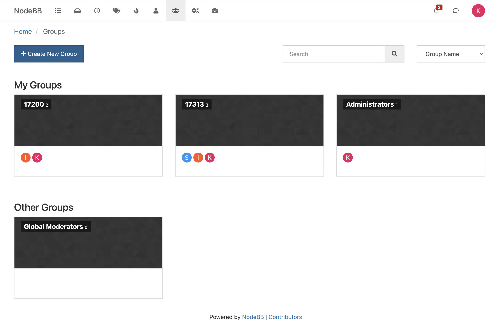
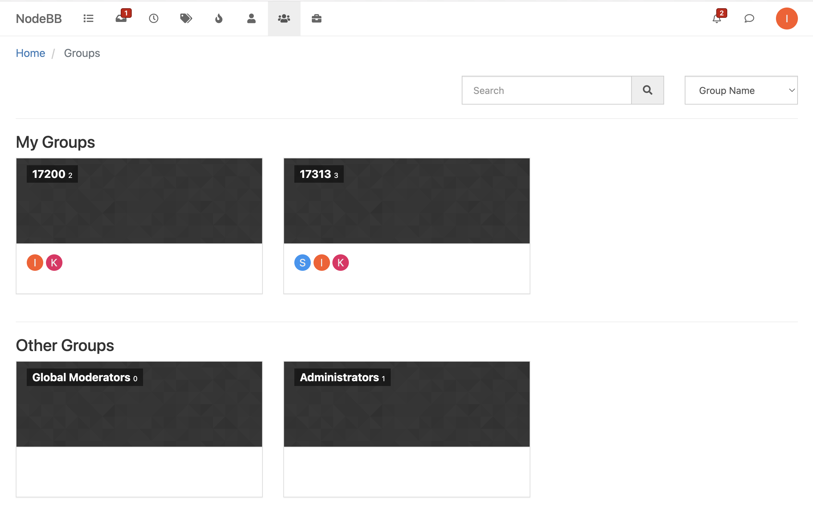
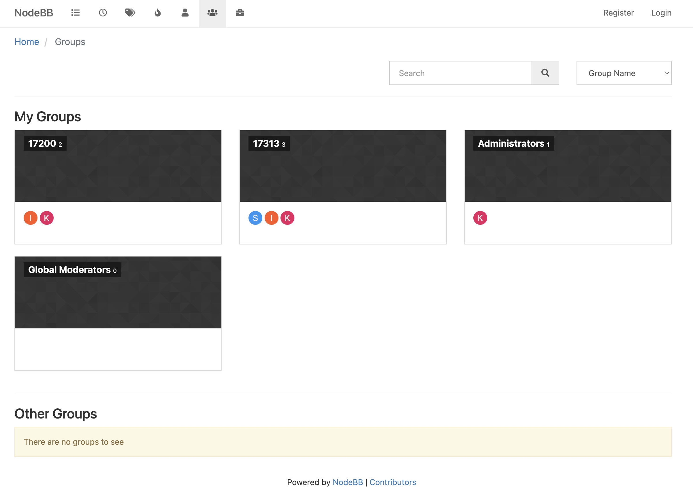
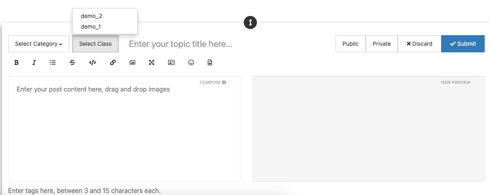
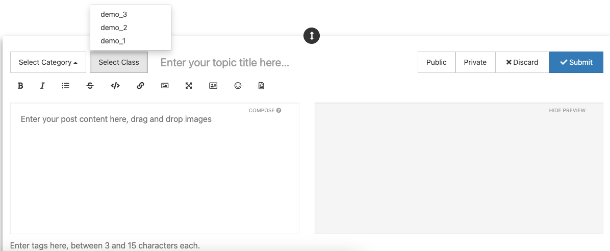
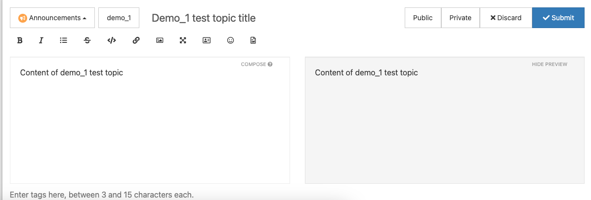
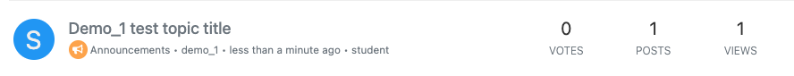
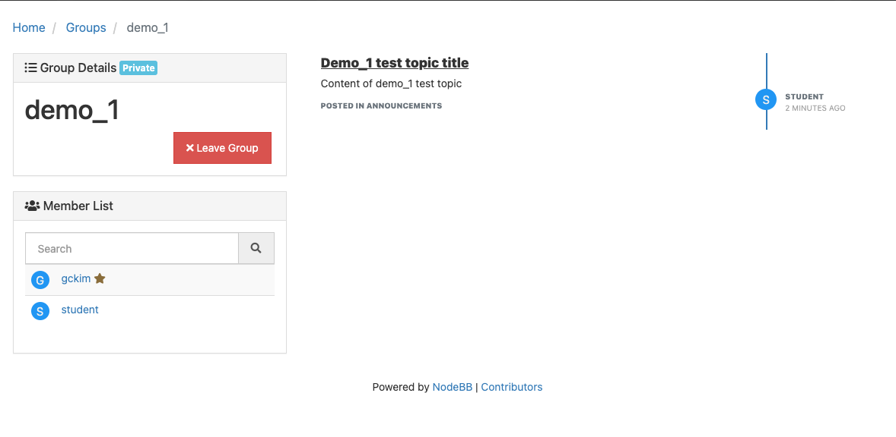
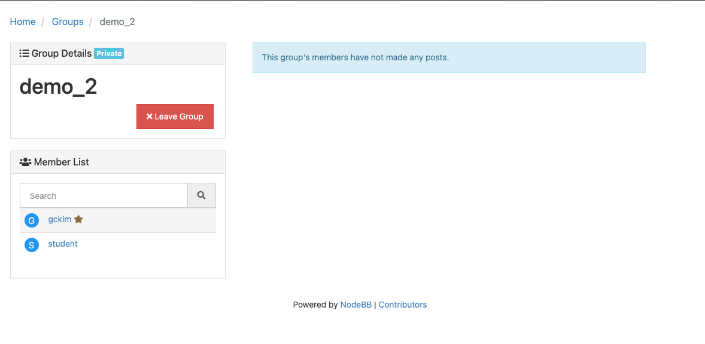

## Kate Lee Documentation

The feature I worked on is filtering the main Groups page into two different subsections called My Groups and Other Groups. This was deemed a useful feature, as if a user sees all groups that exists on nodebb in one big page (i.e. a CMU student seeing all CMU classes to currently exist on nodebb), it is very hard for the user to find the groups they actually want to see, which are the groups that they are a part of. In My Groups, the user should see the groups that they are a member of, and in Other Groups should be all the other groups that the user is not a part of. Clicking on the groups themselves acts the same way as it did previously, leading the user to the page specific to the group.

### A user can test this feature by: 

Clicking on the Groups page from the navigation bar and finding the subsections My Groups and Other Groups.

Example 1: When a user is an Administrator: 

Example 2: When a user is an Instructor (and student alike):

Example 3: When a user is not logged in at all: (should see all groups in My Groups, none in Other Groups)

These are sufficient examples of user tests that explain the UI changes I made. Since I only rearranged the existing group panels, clicking on each of them takes the user to the individual group pages as previously done before. 

### Automated Testing: 

test/groups.js: describe('Group membership tests') creates one user and five groups (groups 1~5), which the user joins groups 1~3 and does not join groups 4~5.

The test it('getUserGroups should return 2 groups the user is a member of') actually tests an existing function getUserGroups (and three functions that are used by the function: getUserGroupsFromSet, getUserGroupMembership, findUserGroups) all located in src/groups/users.js which were never tested before. This checks that the length of the groups that the current user is a member of is exactly 3 as intended, and that the group names match up as well.

The test it it('getUserOtherGroups should return 1 group the user is not a member of') tests the new set of functions that I wrote based off the previous 4 functions: getUserOtherGroups, getUserOtherGroupsFromSet, getUserOtherGroupMembership, findUserOtherGroups.Similarly, this checks that the length of the groups that the current use is NOT a member of is exactly 2 as intended, and that the group names match up as well. 

These tests are sufficient for thc changes I made for the backend of the system. These functions were what I used in src/controllers/groups.js to feed the api routes the two different sets of groups, which is rendered mainly through themes/nodebb-theme-persona/templates/groups/list.tpl.

## Gerald Kim Documentation

The feature that I worked on for this project is classLabels. classLabels function as a tag for topics that link topics to groups, where groups are interpreted as courses. The goal of this classLabel feature is students and instructors to be able to link any topics to a specific class, and for the group page to load only the posts that have been tagged with their respective classLabel. For example, if a student is a member of a math class and an english class, the way NodeBB is currently implemented is that any post that the student makes will be shown on both the math class and the english class group pages. But a post about a math related question shouldn't be viewable in the english class page since it's not relevant. classLabels allow that student to post their math related question to just that math class and an english related question to just that english class. 

Here is how a user can use the features I implemented:

### Tagging a post with a classLabel: 

Currently, I'm logged into a user called student, who is currently in two groups: demo_1 and demo_2. 
When we create a new topic, there will be an option to select a class. As seen in the image above, the only options available to the user are only the groups that the user is a member of. If the student user joins a new group, we can see that the changes will be viewable as well in the image below: 

Now, we will create a new topic for demo_1

Upon creating the new topic, we can also see that a visual indicator for the demo_1 classLabel is viewable (next to Announcements)

We can click the visual indicator to redirect into the demo_1 group page: 

As seen in the image above, we can view the new topic we made tagged with the demo_1 classLabel. If we head over to the demo_2 or demo_3 group page, we can see that this topic is not viewable there because it was tagged with demo_1. 

This concludes the demo on how to use the implemented features

### Testing:
test/groups.js: it('should create a classLabel for a group') - This test checks that a classlabel is generated upon creation of a group. This is sufficient because the code I have written adds a classLabel set into the backend database when a group is created, and the test attempts to retrieve the classLabel from the database to check for existence of the classLabel after we create a test group

test/topics.js: it('should create a new topic with the proper classLabel') - This test checks that the data of a topic that is posted contains the classLabel attribute, when the classLabel data is provided in the input topic data. This is a sufficient test because topics that are tagged with a classLabel should have that classLabel in its metadata and the test posts a test topic with a classLabel referring to a group, retrieves the topic data, and ensures the classLabel attribute exists and matches the group name. 

test/topics.js: it('should check for blank classLabel when not specified on topic creation') - This test checks that the data of a topic contains a blank classLabel attribute, when the classLabel is not provided in the input topic data. This is a sufficient test because topics are not required to have a classLabel, and if they do not, then the classLabel attribute should still exist but be blank, and the test retrieves the data of a topic that was posted without a classLabel and ensures that the classLabel is blank. 

test/groups/js: it('should get only posts with classLabel corresponding to the group') - This test checks that the only posts viewable for a group are the ones tagged with its classLabel. This is a sufficient test because we create new groups, join them as a user,  create a topic tagged with the classLabel of one group, retrieve the latest member posts of both groups from the database, which are the ones that are being viewed in the group page, and ensure that the topic is in group of the tagged classLabel and not in the other group. 

These tests are sufficient for the changes I made for the backend system. I was not able to find any UI tests, so the UI changes I made do not have automated tests. As for the user interaction with classLabel issue, where users gain access to the classLabel for a course group upon joining a group, viewing/using classLabels for only the classes they are a member of, and users adding only at most 1 classLabel for a topic, these are enforced by the composer UI, and the backend that interacts with the composer UI is already tested (retrieving the groups that a user is part of is an api call that is tested, and only choosing at most one classLabel is enforced by the select class button in the composer, which sets the classLabel)
