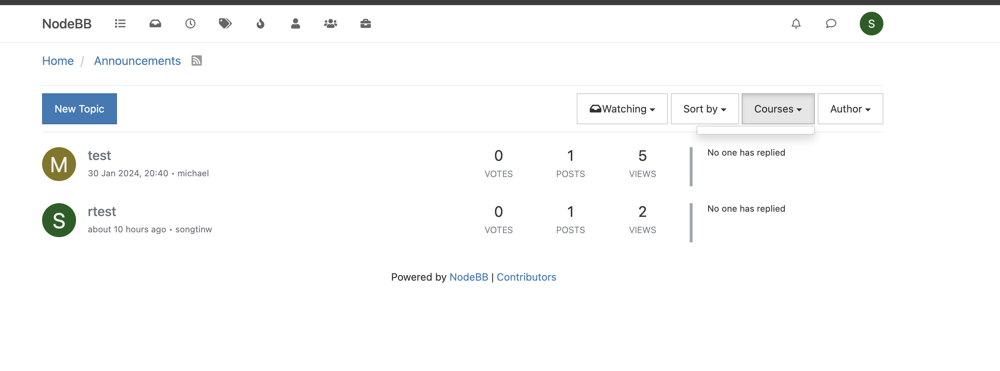
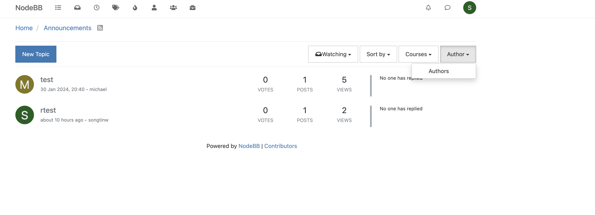

## Michael Wang Documentation

The feature I tried to implemement is to add "filter by Course" and "filter by Author" option when the user is viewing topics after clicked into categories.js (by utilizing group tag and author). With this feature, the user is able to view the posts that are relevant to their course more easily, and they can also find their instructors quicker. 

### Filter Functionality 
- Allow user to filter all of the topics in every category by Course name
- Allow user to filter all of the topics in every category by Author name

### Filter User Testing
This is the frontend visual for the two filter buttons: 

### Filter Unit Tests: 
test/filterCourseTest.js
- Test handles the following scenerios:
- Should filter courses by group
- Should prevent default behavior when clicked
- Should filter courses for the second group
- Should handle multiple group links
- Should handle dynamically added group links

